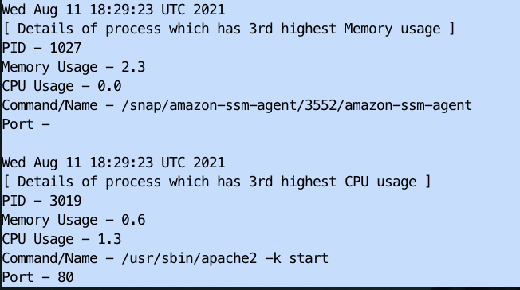

# Process Finder

Script can be used to get details about third most CPU and Memory consuming processes.

Script stores the output to the a file with the following properties:-

- Process Name 
- % CPU  used 
- % Memory used  
- PORT
- PID

The output file name is `process-info.txt`.

---
## 📜 Prerequisites
- This script is built specifically for UNIX and was tested on Ubuntu. It uses bash shell. 
- These commands should be present on your system before running the script:

    >lsof

    >ps
    
    >cut
    
    >awk

---
## 🛠️ Guide

### How to execute the script
```
chmod +x process.sh
./process.sh
```

OR

```
bash ./process.sh
```

### How to check output
- The output file will be present in your current directory i.e. from where you ran your script.

```
cat process-info.txt
```

- This how a sample output would look like:


